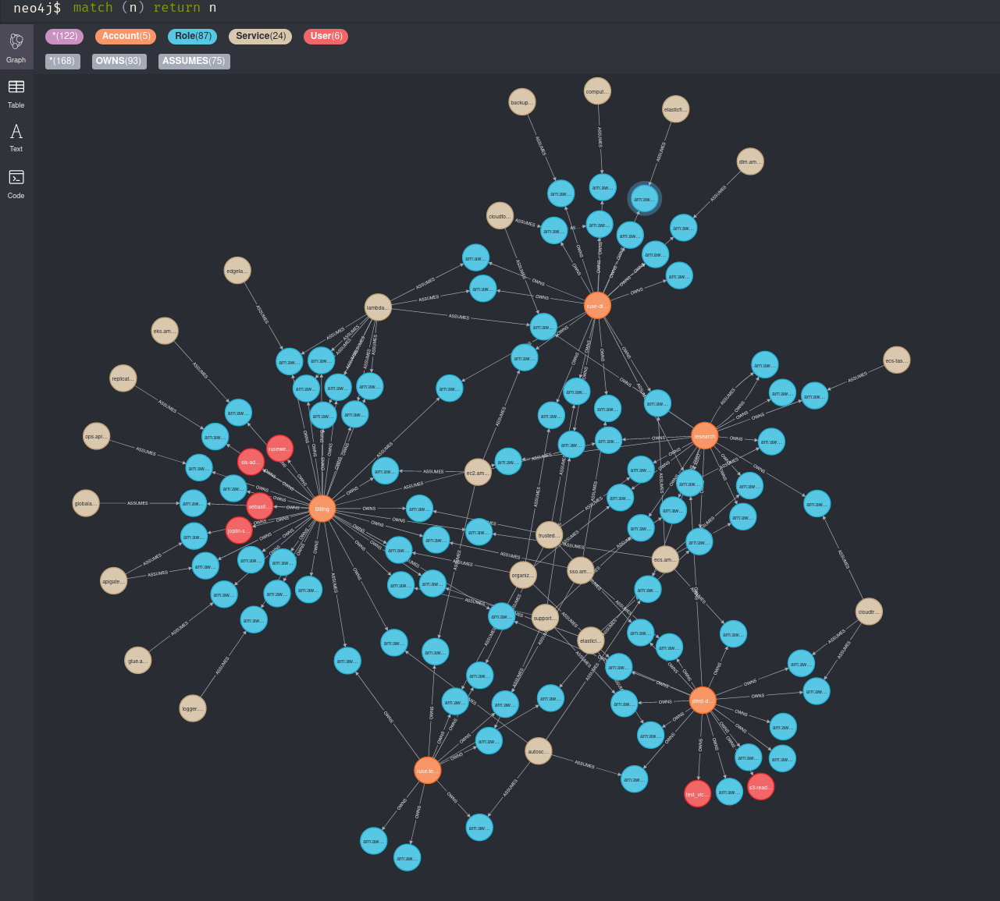

# AWS_ORG_MAPPER

This tool uses sso-oidc to authenticate to the AWS organization. Once authenticated the tool will attempt to enumerate all users and roles in the organization and map their trust relations. 

The graph can be explored using Neo4j desktop or web client. Below you can find some sample queries that can help extract useful information from the graph. 

Using this tool users can discover how role trusts are delegated in the organization and can help identify improve account isolation within the organization. For example, if there exists a role assumption path between two accounts the graph will be able to identify which roles and users are used to connect two accounts. 

## Requirements 

* Neo4j
* boto3
* AWS SSO Account 
* py2neo

## How to Use

Install Neo4j and add the connection details to `config.py`. Configure the SSO organization URL in `config.py`.

Run the tool with `python3 mapper.py`

If there is no `token` file stored in the directory the SSO auth flow will start. The instructions and device link will be printed to the console. After auth, the SSO token will be saved to `./token`. If you wish to run the took on a new org make sure to delete the old `./token` file. 

The tool will attempt to use the first valid role associated with the SSO account. If there is access denied the tool will move the next available role within the account.

Once the tool is done the graph will be have been generated in Neo4j. Using the sample queries below or designed your own by referencing the structure in `## Graph Structure` you can begin to extract information about the organization.

### Notes

Does not currently support SAML Providers or SAML conditions. 

# Example Queries 

* List all Accounts 

  `MATCH (a:Account) RETURN A`

* List all Roles

  `MATCH (r:Role) RETURN R`

* List all users

  `MATCH (u:Users) return u`

* Count number of cross-account relations 

  `MATCH p=(A:Account)-[:OWNS]->(x)-[:ASSUMES]->(y)<-[:OWNS]-(B:Account}) return COUNT(p)`

* Find all paths between account A and account B

  `MATCH p=(A:Account {accountId: "111111111"})-[:OWNS]->(x)-[:ASSUMES]->(y)<-[:OWNS]-(B:Account {accountId: "222222222"}) return p`

* Find all routes from account A to any account 

  `MATCH p=(A:Account {accountId: "111111111"})-[:OWNS]->(x)-[:ASSUMES]->(y)<-[:OWNS]-(B:Account}) return p`

* Find all roles that trust ":root" of an account. 

  `MATCH p=(a:Account)-[:ASSUMES]->(:Role)`

* Find all roles assumed by a specific service.

  `MATCH p=(:Service {Service: "lambda"})-[:ASSUMES]->(r:Role) WHERE r.accountID = "11111111111"`

## Graph Structure

### Nodes and Attributes 

* Role
  - Arn
  - RoleId
  - RoleName
  - accountId

* Account 
  - accountId
  - accountName
  - emailAddress
* User
  - Arn
  - UserName
  - accountId

### Node Relations

* Account -[OWNS]->(Role/User)
* Account -[ASSUMES]-> (Role/User)
* Role -[ASSUMES]-> (Role)
* User

### Acknowledgment 

Thanks to Christophe Tafani-Dereeper for the sso device auth code. Their code can be found here. 

https://github.com/christophetd/aws-sso-device-code-authentication